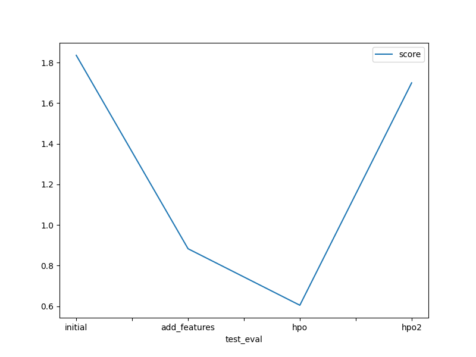

# Report: Predict Bike Sharing Demand with AutoGluon Solution
#### Szymon Strzoda

## Initial Training
### What did you realize when you tried to submit your predictions? What changes were needed to the output of the predictor to submit your results?
* all "count" values were positive
* datetime column was missing from predictions. As index matches for sampleSubmissions we can use pd.merge(test.loc[:,['datetime']], predictions, left_index=True, right_index=True) 

### What was the top ranked model that performed?
WeightedEnsemble_L3

## Exploratory data analysis and feature creation
### What did the exploratory analysis find and how did you add additional features?
* two more features were added from datetime column 
* the train data only contains two years, year should not be considered as significant in context of this dataset
* month and hour were added as separate features
* for month assumption is that the demand is higher in summer months and lower in winter months 
* for hour assumption is that the demand can decrease during night hours and increase during the day 
* additionally, some more features can be added, for exampl day of the week
* for example Friday and Monday demand could be low, as some people take long weekends or WFH 

### How much better did your model preform after adding additional features and why do you think that is?
* Score substantially improved from 1.83581 to 0.88312
* Initially datetime was handed as int (datetime_as_int) 
* datetime as int seems not statistically significant
* In context of bike sharing demand the part that matters is month and hour
* Model fit works better with month and hour as separate features

## Hyper parameter tuning
### How much better did your model preform after trying different hyper parameters?
* As per AutoGluon https://auto.gluon.ai/stable/tutorials/tabular/tabular-essentials.html documentation if you have limited budget, tuning hyperparameter_tune_kwargs and hyperparameter should be avoided
* I assumed that default hyperparameters values are good starting point and only specified hyperparameter_tune_kwargs
* 'auto' value will perform bayesian optimization search on NN_TORCH and FASTAI models and random search on other models.
* 10 trials will be run 
* scheduler is local, which is only supported option 
* based on TabularPredictor output, for some models tuning was performed (eg. LightGBMXT_BAG_L1, XGBoost_BAG_L1)
* For most models no hyperparameter search space was specified. In that case HPO was skipped and one model based on the provided hyperparameters was trained.
* hpo2 comment (review): after specifying hyperparameters and hyperparameter_tune_kwargs the score substantially degraded

### If you were given more time with this dataset, where do you think you would spend more time?
* feature engineering: for example day of week (my guess is that demand can change on Monday and Friday)
* add public data to the dataset. For example price of fuel, inflation rate or some economic indicators
* consider not only national holidays but also high school summer breaks etc.
* identify and get rid of not relevant features

### Create a table with the models you ran, the hyperparameters modified, and the kaggle score.
hpo - only hyperparameter_tune_kwargs was specified
hpo2 - hyperparameters and hyperparameter_tune_kwargs (review)

| model        | hpo1 | hpo2  | hpo3 |score|
|--------------|------|-------|------|-|
| initial      | n/a  | n/a   | n/a  |1.83581|
| add_features | n/a  | n/a   | n/a  |0.88312|
| hpo          | 10   | local | auto |0.60480|
| hpo 2        | 10   | local | auto |0.60480|

### Create a line plot showing the top model score for the three (or more) training runs during the project.

### Create a line plot showing the top kaggle score for the three (or more) prediction submissions during the project.

## Summary
4 different approaches were presented: using raw data, feature engineering, hyperparameter_tune_kwargs and hyperparameter_tune_kwargs along with hyperparameter tuning in AutoGluon regression TabularPredictor.
In terms of improvement, the best results were achieved by identifying new features.

